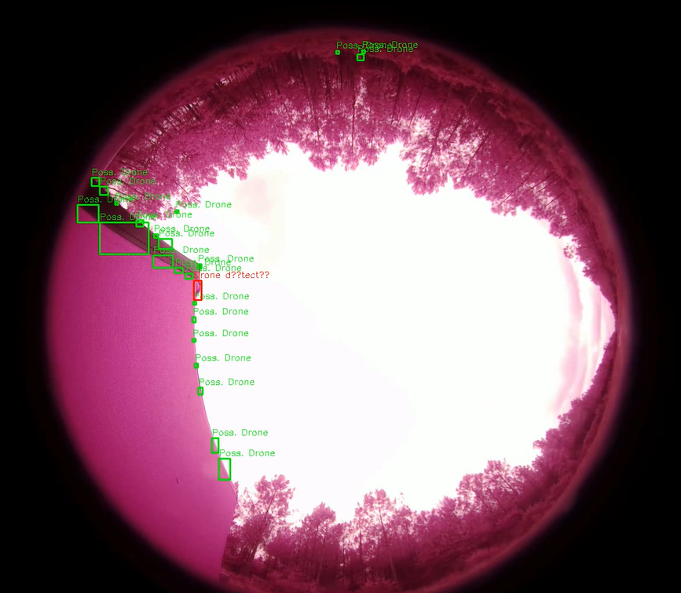
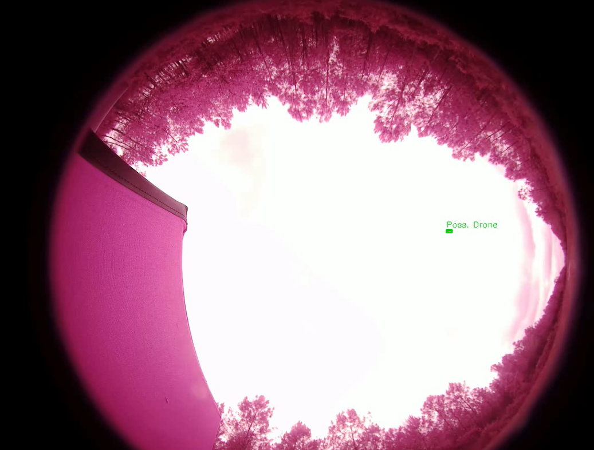
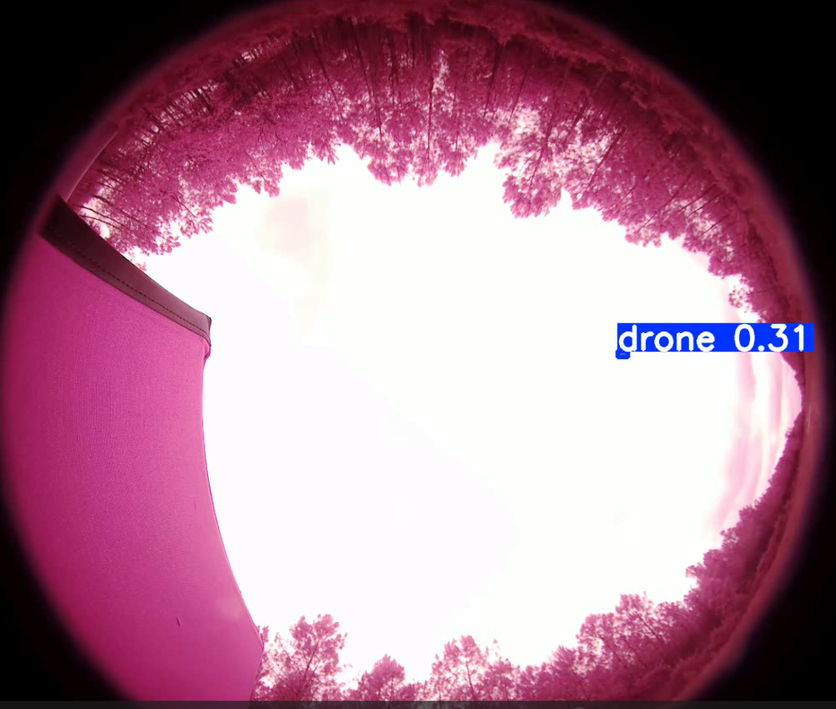
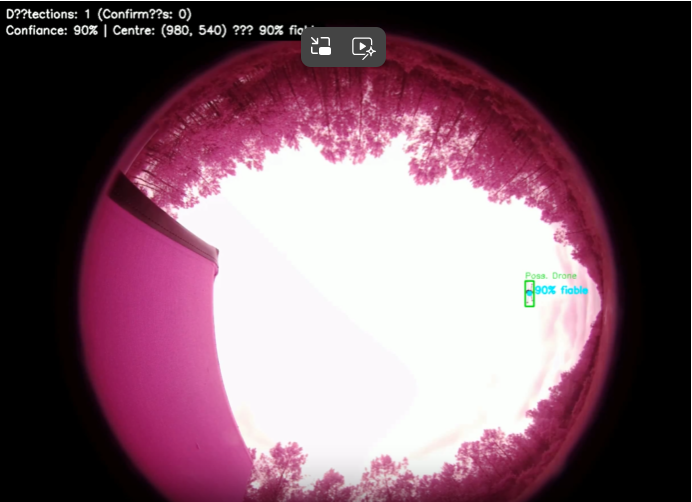
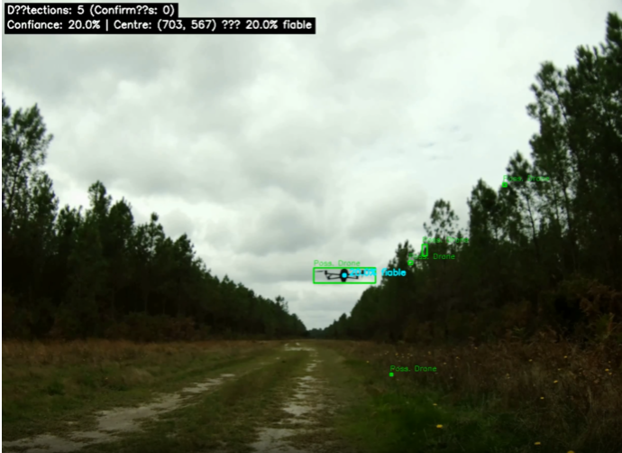

**Équipe :**  
- ROBLIN Pauline  
- BASTIEN Hugo  
- ROUAULT Olivier  
- LARRAGUETA César 

# I. Solution mise en œuvre

L’application développée est fournie sous forme d’une image Docker. Cela permet d’avoir tout l’environnement déjà prêt : Python, les dépendances et les outils nécessaires. L’image utilise Poetry pour gérer les librairies Python, ce qui garantit que tout fonctionne de la même façon sur n’importe quel ordinateur.
Quand l’application est lancée, elle ouvre automatiquement une interface web Streamlit sur le navigateur, en local. Cette interface permet à l’utilisateur de :
- choisir la vidéo qu’il veut analyser,
- sélectionner le type de traitement à appliquer (pipeline),
- lancer le traitement,
- voir la vidéo d’origine et la vidéo traitée,
- consulter les loggs obtenus (vitesse de traitement, étapes du traitement, stockage...)

## II. Méthodologie

### II.1 Architecture multi-cœur

Le projet utilise une architecture modulaire et multiprocessus, où chaque étape (lecture, traitement, affichage, sauvegarde) s’exécute indépendamment et communique via des queues. Cela permet un traitement parallèle efficace et une bonne réactivité, même sur des vidéos longues.
- **VideoReader** lit les frames et les transmet dans une queue.  
- **PipelineProcessor** récupère chaque frame, applique le pipeline choisi et envoie le résultat.  
- **DisplayProcess** affiche en temps réel les frames annotées (désactivé en mode Docker).  
- **StorageProcess** enregistre la vidéo traitée et les éventuels fichiers de logs.
---

### II.2 Pipeline modulaire

Le projet utilise une architecture en pipeline, composée de blocs modulaires permettant de traiter les images étape par étape. Deux types de blocs sont définis :

- **Image blocks** : opérations sur une seule image.
- **Video blocks** : opérations nécessitant la mémoire ou le contexte des frames.

Les blocs peuvent être combinés dans un ordre configurable, ce qui facilite les tests. Chaque pipeline produit un ProcessingResult avec l’image annotée et les informations utiles, et le StorageProcess sauvegarde les vidéos traitées ainsi que les logs.

---

### II.3 Interface

L’interface utilisateur est développée avec **Streamlit**, que nous avons choisi pour sa rapidité de mise en œuvre et sa simplicité d’intégration. Après exécution, la vidéo annotée ainsi que les logs du traitement sont affichés.

---

### II.4 Algorithme de détection implémenté dans Docker
L’algorithme implémenté dans Docker repose sur les méthodes classiques de traitement d’images. Le fonctionnement global repose sur une détection des zones en mouvement, puis d’une identification parmi elles des régions ressemblant à un drone :

1. *Redimensionnement de l’image (ResizeBlock)*: permet d’avoir une taille fixe de toutes les frames pour généraliser les seuils de détections et rendre le traitement plus stable d’une vidéo à l’autre, et réduire les frames trop grandes pour la rapidité du traitement 
2. *Soustraction de fond MOG2 (BackgroundSubstractorBlock)* :  permet de détecter les zones en mouvement, car nous sommes partis du principe que le drone est majoritairement en mouvement dans les vidéos.
3. *Nettoyage du mask MOG2 (ThresholdBlock & MorphologyBlock)*: Seuillage sur les pixels, opérations morphologiques (opening et closing) pour supprimer au maximum le bruit et remplir les trous, afin d'éviter les faux positifs.
4. *Détection de régions par contours (ContourMatchingBlock)*: permet de sélectionner les zones assez grandes et ignorer les toutes petites zones en mouvement, en passant par des boîtes englobantes.
5. *Vérification par matching ORB (ORBMatchingBlock)* : sur chaque boîte, on compare les descripteurs ORB de la ROI avec les patterns de drones, afin de ne selectionner que les détections ressemblant à un drone et supprimer les mouvements parasites.
6. *Annotations* : dessin du rectangle autour du drone, affichage des coordonnées dans l’image, et métadonnées pour afficher la performance et faire le feedback à l'utilisateur. 
---

### II.5 Tests d'implémentation de YOLO
Avec les méthodes classiques de traitement d’image, nous avons vite atteint des limites, surtout dans les vidéos avec des arbres ou des arrière-plans complexes. Le système était surtout confronté à la détection de faux positifs à cause du bruit environnant. 

Nous avons testé une approche IA avec YOLOv8, en annotant un ensemble de 1176 frames échantillonées à partir de 6 vidéos(fond forêt, ciel, drone statique, drone en mouvement) à l'aide de Roboflow, afin d’évaluer la capacité du modèle à détecter correctement le drone tout en limitant les faux positifs et les faux négatifs dans différents contextes. Cependant, nous ne l’avons pas intégré dans Docker, car ultralytics augmentait la taille de l’image à plus de 30 GB, ce qui n’est pas adapté à un système embarqué.

---
### II.5 Tests et métriques de performances
Le tableau ci-dessous présente les métriques obtenues sur le jeu de validation pour notre modèle YOLOv8n, entraîné sur 1000 images (train), 155 images (valid) et 21 images (test). Elles décrivent la performance du modèle sur les images annotées et servent de référence pour comparer cette approche à notre pipeline classique. Ces résultats doivent toutefois être interprétés avec prudence, car ils dépendent fortement du dataset et ne garantissent pas les mêmes performances sur les vidéos complètes.
| Metric     | Value |
|------------|-------|
| Precision  | 0.809 |
| Recall     | 0.648 |
| mAP50      | 0.734 |
| mAP50-95   | 0.432 |

- **FPS du traitement** : Que se soit pour YOLO ou pour notre Pipeline de détection, les performances ne permettent pas de faire pleinenement du temps réel car le traitement prend un certain temps. YOLO est nottament plus lent que le traitement classique. Sur un même ordinateur et pour le traitement d'une vidéo de 668 frames (16sec) : YOLO traite l'ensemble des frames en moyenne à 1.7FPS (7min), tandis que notre Pipeline les traite à 6.6 FPS (1min30). 
- **Faux positifs** : YOLO génère très peu de faux positifs et reste précis, détectant au maximum 3 boxes par frame, tandis que MOG2+ORB peut en produire des dizaines, surtout lors de mouvements de caméra.

MOG2 + ORB (sans aucun drone visible):

YOLO : Ne détecte aucun drone au même instant de la vidéo
- **Faux négatifs** : Au contraire, MOG2+ORB est plus robuste contre les faux négatifs, tandis que YOLO peut perdre le drone par moments, surtout avec un petit dataset d'entrainement. Cependant, lorsque le drone est statique, YOLO détecte mieux que notre pipeline.
- **Limites de détection** : Sur une même vidéo, les deux algorithmes perdent la détection du drone au même moment quand il devient trop petit (moins d'environ 10 à 20 pixels) sur une image de 1280×720), ce qui est plutôt raisonnable car cela signifie que le drone est loin (moins dangereux).

Dernière détection par éloignement du drone :
MOG2 + ORB :

YOLO :

- **Robustesse aux types de caméras et au background** : Notre pipeline est beaucoup plus performant pour les vidéos fisheye que pour les vidéos classiques, certainement lié au mouvements moins prononcés des arbres dans ce format. Il est également plus performant sur un fond uni (ciel) que devant une foret (mouvement des feuilles.)

Fish eye :

Caméra classique : 

- **Confiance** : Contrairement à YOLO, qui calcule un score de confiance interne, notre pipeline MOG2+ORB utilise une logique simple : 1 boîte détectée → 90%, 2 à 5 boîtes → 100%/nombre de boites, et plus de 6 boîtes → 0%.

La boîte la plus grande est retenue pour placer le centre du drone. Ce choix est simple et peut largement être amélioré mais il permet un premier feedback sur la détection.  
- **Poids de l'application** : 3GB 

### II.6 Limites et perspectives 
Notre application n’est pas encore capable de fonctionner en temps réel, surtout sur des vidéos longues ou avec l’utilisation de YOLO, qui est assez lent. Le système a également des difficultés lorsque la caméra bouge, ce qui peut rendre la détection du drone moins fiable. Nous n’avons pas eu le temps d’ajouter la prédiction de trajectoire pour anticiper les mouvements dangereux, ni d'unifier les aproches IA et classiques.

La structure modulaire du code facilite toutefois la modification des pipelines et permet d’envisager facilement des améliorations pour un traitement quasi temps réel. Pour l’avenir, il serait possible de réduire la taille de l’image Docker, améliorer la robustesse sur des arrière-plans complexes ou avec du mouvement (en combinant méthodes classiques et IA), et mettre en place un suivi plus précis du drone pour mieux prédire ses déplacements. Ces évolutions rendraient le système plus performant et utilisable dans des conditions proches du réel.
